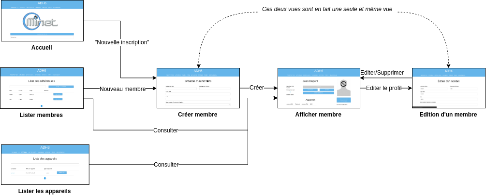

# ADH6
Auteur original: *Nicolas Bonnet*

Liste des contributeurs:
* Aurélien Duboc
* François Horta 

## Notes
Je vous invite **vivement** à aller lire [la page sur le wiki](https://wiki.minet.net/wiki/services/adh6) avant de vous plonger dans l'exploration de ce repo.

Si vous voyez une modification à apporter (correction de faute, éclaircissement d'un point, ajout d'instructions supplémentaire, mise à jour d'anciennes information, etc.) **n'hésitez pas à faire un commit et à vous ajouter dans la liste des contributeurs**. Toute aide est la bienvenue !

## Présentation
ADH est le système de gestion d'adhérent de l'association [MiNET](https://minet.net). Ce document a pour but de présenter la sixième version de notre outil.
## Motivations
Nous voulons produire un outil de gestion des adhérent **simple à maintenir**. Pour cela, nous prônons la *simplicité* dans *toutes* les parties de notre projet. Le but est de créer un outil maintenable, qui effectue **sa mission et qui l'a fait bien**.

Pour cela nous avons décidé de **dissocier le backend du frontend**. Ainsi un changement d'interface ne nous obligera pas à réécrire toute la logique du code (comme c'est le cas avec la précédente version).

Pour atteindre ses objectifs, nous essayons de **réduire le boilerplate code** en utilisant des bibliothèques qui sont *réputées et prouvées stables*. Cela permettra d'avoir moins de lignes de code, plus de *readability* et donc moins de potentiel bug.

La **fiabilité** de notre outil est aussi un concept important à nos yeux. C'est pour cela que nous faisons beaucoup appels à des **tests d'intégration** (*200+ pour la partie backend pour l'instant*). Nous visons un taux de *code coverage* le plus haut possible.

## Comment contribuer ?

Allez sur gitlab.minet.net sur [la page du projet](https://gitlab.minet.net/adh6/core/). Si vous n'avez pas les accès, n'hésitez pas à les demander à zTeeed ou InsolentBacon (vous pouvez les contacter tous les deux dans la vraie vie ou sur mattermost/IRC). Une fois que vous y êtes, allez voir dans les issues, trouvez une qui vous plaît et assignez la vous! N'hésitez pas à demander des précisions sur les issues (aux deux mêmes zigotos), nous nous ferons un plaisir de tout vous expliquer!

## OK, maintenant comment je lance en local?

1. Installez *docker* et *docker-compose*. C'est le système qui va permettre de créer des environnements de dev' sur votre machine en local.

Pour **Ubuntu/Debian**:
> apt install docker docker-compose

Pour **Arch Linux**:
> pacman -S docker docker-compose

Pour **Gentoo**:
Les gars, vous avez installé gentoo, vous avez vraiment besoin des instructions pour installer docker?! Bon OK:
> emerge --ask --verbose app-emulation/docker app-emulation/docker-compose

2. Lancez l'application (le premier démarrage va prendre du temps, docker va construire toutes les images, installer plein de dépendances dans les environnements virtuels).

> make clean run

*Vous aurez sûrement besoin de lancer le service docker. Avec systemd:*

> systemctl start docker

Vous aurez sûrement à vous ajouter au groupe *docker* pour éviter de lancer docker-compose en root. (Vous aurez sûrement à vous re-logger après)
> usermod -aG docker votre_nom_d'utilisateur

Le premier lancement peut prendre beaucoup de temps (genre au moins 15 mins). Il va installer et set-up tous les environnements dockers.  
Ne vous inquiétez pas, lancer les dockers sera bien plus rapide les prochaines fois que vous re-lancerez.

Vous pouvez tester l'application dans votre navigateur à l'adresse https://localhost
Vous pouvez vous identifier avec comme username *minet* et comme mot de passe *minet*.


**NOTE**: Le certificat est auto-signé. Les navigateurs web récents permettent d'activer une option pour toujours faire confiance aux certificats pour localhost.

Chromium: https://stackoverflow.com/questions/7580508/getting-chrome-to-accept-self-signed-localhost-certificate


Normalement, une fois que le projet est lancé, vous aurez les logs de tous les dockers dans la console.
Si vous éditez le code du Frontend (angular) dans votre dossier, les modifications seront automatiquement réfléchies (vous allez voir des logs comme quoi il recompile automatiquement). 
Pour le code de l'API, modifiez votre code et faites *`docker-compose restart api_server`*.

Si vous modifiez autre chose, vous pouvez aussi tout relancer.

PS: Parfois, lorsque que vous ajoutez un fichier, il faudra éteindre adh6 puis faire `make clean run`.


### Faire des modifs en live sur la BDD

Pour des raisons de test, vous voulez accéder à la BDD pour ajouter/supprimer des entrées, c'est très simple :

- `docker exec -it core_database bash`
- `mysql -u adh6 -p` le mdp est par défaut "adh6_pass"
- `USE adh6`;
- enjoy

## Choix des technos
### Communication client/serveur

Pour communiquer entre le client et le serveur, nous avons décidé d'utiliser une API.
En terme de techno, on a décidé de prendre la techno la plus stable et universelle (compatible avec tous les futurs projets), HTTP.

Nous avons décidé de ne pas reprogrammer à la main tout un client/serveur pour notre API. Ca aurait était faisable, mais trop error-prone et on risque de perdre en flexibilité (un changement dans l'API devrait être réfléchi dans le code du client ET du serveur). Nous avons donc décidé d'utiliser un système de "generation" de code automatique à partir d'une spec.

Pour définir la specification de notre API nous utilisons OpenAPI (aussi appelé swagger, oui, oui...).

Pour générer le code serveur, on utilise d'un côté connexion, qui est une libary python développée par Zalando. https://github.com/zalando/connexion Allez voir le repo, il est assez actif. C'est aussi la bibliothèque de génération de code prise comme référence par Swagger (l'organisme qui fait OpenAPI).

Pour le côté client, on utilise directement openapi-generator, (fork de swagger-codegen, édité directement par Swagger). https://github.com/OpenAPITools/openapi-generator Pareil, allez voir leur repo, il est "assez" actif... (12 233 commits à l'heure où j'écris ces lignes, et plus de 1100 contributeurs...)
Ca semble donc aussi être un assez bon choix pour produire un code stable.

En résumé, on a pris le parti prix d'ajouter deux dépendances au projet, mais on a gagné en flexibilité et en maintenabilité.


## Dossier: api_server - le backend

Si vous voulez directement interagir avec l'API sans vous embêter avec des cURL, allez sur votre navigateur à l'adresse https://ADRESSE-DE-ADH/api/ui

###  Je suis perdu, qu'est-ce que c'est que tous ces dossiers ?
Ce projet consiste juste en l'implémentation des différents méthodes définies dans la spécification de l'API.

Si vous êtes un PGM et que vous voulez juste lire le code, sachez juste que tout le code est dans le dossier *adh/*.

Pour que python se comporte en serveur Web on utilise *Flask*, et pour pas avoir à faire de trucs compliqués on utilise *connexion* qui fait le binding entre *Flask* et les fonctions en python qui sont appelées presque magiquement.

La spécification de l'API est stockée dans swagger.yaml à la racine du projet, ce fichier est automatiquement exporté de swaggerhub.
https://app.swaggerhub.com/apis/insolentbacon/adh/

Si vous voulez modifier l'API, ne modifiez pas sur ce site (de toute façon vous n'aurez sûrement pas les droits), modifiez le fichier openapi/spec.yaml.**
Le site permet just d'avoir une jolie représentation de l'API.

*En gros*, les fonctions importantes sont juste celles dans *adh/controller/*, qui sont appelées quand on fait des requêtes vers le serveur web.

Maintenant, parce qu'on veut pas faire de requêtes directement dans la BDD SQL (pour des raisons de sécurité et de flemme), on utilise *SQLAlchemy*. 
C'est en fait une bibliothèque qui permet de manipuler des objets dans la BDD comme des objets python (allez chercher ce qu'est un *ORM*).

En résumé on a:

- **controller/**: Le plus important, c'est là où sont les fonctions qui sont appelées lorsque une requête HTTP est effectuée sur l'API.
- **model/**: C'est là où on définit ce qu'il y a dans la base de données (c'est à dire les noms des tables, des colonnes, les contraintes qu'il y a sur les champs [genre une IP doit être valide]). On importe ensuite les modèles dans les controllers pour manipuler la BDD
- **exceptions/**: c'est là où on met les erreurs custom qu'on a défini, c'est peu important
- **test/**: c'est là où il y a des les tests. C'est super important. On teste chacune des lignes de code des fichiers .py (on vise un *code coverage* de 95%)
Les cas normaux et extrêmes doivent être testés. C'est ce qui est executé lorsque on lance pytest.

### Notes au futurs devs:
#### Comment installer toutes les dépendances python
```
cd api_server/

# Installez pip et python3.
# Pip est le package manager de python.
apt install python3 python3-pip 

# Installation du paquet virtualenv, pour faire des environnements de développement.
# Cela va vous éviter à avoir à installer les dépendances de ADH6 pour tout votre ordi, et 
# cantonner toutes les installations de dépendances à ce dossier. (On pollue pas l'ordi et en plus
# on a peu de chance d'avoir des conflits avec d'autres trucs déjà installés)
pip3 install virtualenv

# Initialisation d'un nouvel environnement virtuel vierge. (à ne faire qu'une fois)
virtualenv -p python3 venv

# Ci-dessous est la commande que vous ferez à chaque fois que vous voudrez 'entrer' dans cet environnement.
# (en gros quand vous faites cette commande vous avez accès aux dépendances ajoutées dans ce dossier plutôt
# qu'à celles de votre PC.)
source venv/bin/activate

# Et on installe toutes les dépendances de ADH dans l'environnement virtuel.
pip install -r requirements.txt

#### Comment ajouter une dépendance Python
Ajoutez votre dépendance dans requirements.in (*pas .TXT*).
Puis lancez:
```
pip-compile # Genere un fichier requirements.txt
pip-sync # Telecharge les deps et supprime les anciennes.
```
...
```

Pour ensuite quitter cet environnement vous avez juste à taper `deactivate`

#### Comment lancer les tests ?
Lancez ```pytest``` dans la console, ou utilisez votre IDE...

#### Comment obtenir une analyse du "code coverage" ?
```pytest --cov=adh --cov-report html``` dans la console. (ou vous pouvez allez voir dans l'onglet CI de gitlab, dans la partie jobs)


## Dossier frontend_angular: le frontend

*NOTE: nous utilisons la version 7 d'Angular*



Voici le diagramme de toutes les vues d'ADH6 pour son cas d'utilisation
principal (c'est à dire, gérer les profils d'adhérents).
### Mettre à jour l'API dans Angular

Contrairement au backend, lorsque vous faites une modification dans spec.yaml, cette modification n'est pas reportée dans le code du frontend.
Il faut manuellement re-générer le code pour communiquer avec l'API pour le mettre à jour.

Pour cela, `make generate` et c'est fini !

#### Pourquoi commit les fichiers générés?
> Cela nous permet d'avoir un build reproductible.
> Si jamais on clone le repo, on doit pouvoir build.
> Un changement dans swagger-codegen pourrait entraîner un code légèrement différent et donc casser ADH.
>
> En committant les fichiers générés on "fixe" l'état d'ADH.

## CAS
### Description
CAS est le service qui gère l'authentification des actions des utilisateurs.

Le protocole utilisé est OAuth2.

# API ADH

## Architecture du projet

Bon. 
Au sein de votre vie vous aurez l'occaion de voir beaucoup de projet fait à l'arrache, sans réelle réflexion sur la façon de construire les choses et qui sont grosso-modo dégueulasse et difficilement maintenable.

Vous aurez aussi l'occasion de voir des projets qui sont 'over-designed', où la personne responsable du projet prend 20 ans à réfléchir au bon *design pattern* a appliquer pour **chaque** fonctionnalité mineure du projet.
Résultat le projet n'aboutit jamais parce que on passe 1 semaine à faire un truc qui se code en 1 heure.

Mon objectif, pour ADH est de vous montrer ce quest un projet *backend* avec une belle architecture, mais sans aller dans l'*over-design*. 
J'espère que l'architecture choisie vous convaincra par ses qualités de maintabilité.
Vous pourrez réutiliser les principes dans d'autres projet (backend ou frontend).

## Clean/Onion architecture

Un type d'architecture qui est grosso-modo unanimement reconnu dans le monde de l'info comme un bon modèle est la *clean archi* telle que décrite par  Robert C. Martin (Uncle Bob).

C'est aussi assez connu dans le monde du développement mobile, pour l'anectode j'ai un ami qui est tombé en entretien sur une question là dessus. 

[Vous pouvez voir l'article de *Uncle bob* sur son blog pour comprendre en détail.](https://blog.cleancoder.com/uncle-bob/2012/08/13/the-clean-architecture.html)


Le principe est assez classique: vous divisez votre application en couches, qui ont chacun un rôle bien défini. 
Le très connu [(si vous avez fait du web) modèle MVC](https://fr.wikipedia.org/wiki/Mod%C3%A8le-vue-contr%C3%B4leur) en est un exemple.

La *clean archi* en est une généralisation. 

Pour comprendre, je vous propose d'analyser ces couches une par une en prenant l'exemple d'ADH.

Si vous regardez dans le dossier `src/` vous retrouverez le nom des différentes couches et le code associé.

### Entity layer (Layer 1)

C'est le **coeur** de tous les projets. 

Les entités sont en quelque sorte les données gérées par l'application/l'assocation.

Normalement, un système gère de l'information (sinon ça sert à rien de dev' une application...), et c'est ça les entités.

Ce sont des structures de données très simples qui ne font que contenir de l'information (ce sont des [DAO](https://en.wikipedia.org/wiki/Data_access_object)s si vous aimez le Java).

Il ne doit pas y avoir de code/logique/algorithme dans cette couche! C'est juste de la donnée, ce qui donne la raison d'être de l'application.

**Pour ADH:** ADH est une app de gestion d'Adhérents. On retrouve donc une classe `Member`, très simple, qui contient les données utiles à MiNET concernant un adhérent.

On va aussi avoir d'autres données que l'application va gérer comme les chambres (`room`) ou le réseau (`port`, `switch` et `vlan`).


### Use case (Layer 2)

C'est le comportement de l'application. 

Il contient ce qu'on appelle la *Business logic*:
Quand vous avez un cas d'utilisation et que vous l'exprimez sous la forme d'un algorithme, c'est ce que vous allez mettre dans cette couche.

Cet algorithme doit être **TOTALEMENT** indépendant de la partie technique. Autrement dit, que ça soit une API HTTP qui communique avec du SQL, ou alors une personne réelle qui prend en charge les adhérents en notant les adhésions sur un carnet, l'algorithme doit être **le même**.

Vous allez toucher à cette couche quand vous voudrez changer le fonctionnement de ADH.

**Pour ADH:** pour la cotisation d'un adhérent
Si on avait à écrire en pseudocode ça donnerait un truc du genre:
> 1. Quand tu reçois une demande d'adhésion (que ça soit un gars qui te demande ou un appel HTTP)
>
> 2. Inscris une nouvelle écriture comptable dans le livre journal (on sait pas si c'est un livre journal physique ou une base de donnée)
>
> 3. Enregistre que l'adhérent a cotisé jusqu'à le 12 janvier 2100... (pareil, peu importe où on enregistre, c'est pas notre problème dans cette couche)
>
> 4. Active le port de l'adhérent (on pourrait utiliser une communication directe avec un switch ou alors demander à un admin de SSH sur le switch et de le faire manuellement)

Bon, dans ADH, plutôt qu'en pseudo-code on l'a fait en Python... Mais c'est presque pareil ! :D

Cette façon de faire, sans jamais mentionner la technique, nous permet de nous abstraire de TOUTE dépendance à une bibliothèque ou technologie qu'on utilise.

Si jamais un jour on ne veut plus utiliser MySQL, mais Redis ou elasticsearch pour stocker des données... Ben on aura pas à modifier ces deux premières couches. 
Pareil, si on en a marre des API REST et qu'on veut utiliser gRPC ou autre, on pourra.

Encore plus important: si on utilise une bibliothèque/framework comme Flask, connexion et SQLAlchemy et que l'un vient à être abandonné (ou qu'il y a une grosse faille de sécu), l'application n'en dépend pas et on aura pas à TOUT modifier.

**Point important: Vous ne devez pas importer des bibliothèques ni des classes de la prochaine couche ici. (Voir la *law of include* de l'article de Uncle Bob)**


### Interface handler (Layer 3)

C'est la couche technique. 
Très clairement, vous ne définissez aucun comportement de l'application ici, vous faites juste une interface entre le monde et l'application.

Si jamais vous changez la technologie derrière ADH, vous irez faire des modif ici.

**Pour ADH:**

*Pour le stockage*, vous allez faire des classes qui implémentent les opérations de base [CRUD (Create, Read, Update, Delete)](https://en.wikipedia.org/wiki/Create,_read,_update_and_delete) et jamais plus compliqué. Toutes les opérations plus compliquées, ou les décisions qui n'ont pas de rapport avec la technologie utilisée derrière doit être mis dans les use cases. 
Ca doit rester débile!


*Pour l'API*: les points d'entrée de l'application se trouvent aussi dans cette couche. 
Puisqu'on arrive dans l'appli par un appel HTTP, on a des fonctions qui vont gérer la requête, transformer les données brutes en entité, faire appel au use cases, et renvoyer les bons code d'erreur HTTP.

### Framework & drivers (Layer 4)

Cette partie, ça correspond pas vraiment a notre code mais plutôt aux dépendances qu'on utilise. 
Ici on va retrouver SQLAlchemy, connexion, flask, le client Elasticserach, etc...

En gros c'est le contenu de requirements.txt.


## Un exemple de bout en bout...
Je vais prendre un exemple simple: la création d'un appareil.

Vous (en tant qu'utilisateur) faites une requête HTTP vers adh6.minet.net contenant la MAC de votre nouvel appareil.

1. Les bibliothèques *connexion* et *Flask* utilisée par ADH6, prennent cette requête, et l'interprête. (Layer 4) 
Les bibliothèque appellent une fonction python.

2. Une fonction python (dans `src/inteface_handler/http_api/device.py`) reçoit la requête HTTP et la transforme en une entité, un truc compréhensible pour l'application sans avoir aucun lien avec la techno utilisée pour recevoir le message. (Layer 3) Cette fonction va ensuite appeler le use case `create_device`.

3. Le use_case create_device (dans `src/use_case/device_manager.py`) va lire l'entité de l'appareil, vérifier que l'adresse MAC est bien valide, que tout est bon (layer 2), et va faire une demande à un *repository* (interface abstraite qui représente un moyen de stocker des appareils, voir les notes ci-dessous en italique), de sauvegarder l'appareil. 

4. `DeviceSQLRepository` est une classe qui implémente (en gros elle satisfait toutes les contraintes) DeviceRepository, elle est utilisée par la use case et va utiliser SQLAlchemy pour créer (bêtement) un appareil. (Layer 3)

5. SQLAlchemy contacte le serveur MySQL pour faire l'écriture (Layer 4)


*Une interface est une sorte de patron, un moule, une contrainte, par exemple... un repository pour appareil doit au moins avoir une méthode qui permet de créer un appareil... Ces interfaces font partie de la couche 2*

*Si vous vous posez des questions de pourquoi je vous parle des interfaces, allez lire l'article de Uncle Bob sur la Law of Include, en théorie on a pas le droit (dans le use case) d'importer des fichiers de interface_handler.
Utiliser une interface permet de dépasser cette limitation*


Comme vous pouvez le voir, lors de chaque appel, on rentre dans l'*onion* de la couche 4 à 1 (même si il n'y a pas de code, la couche 1 est utilisée grâce aux entities). 
Puis on ressort de la couche 1 à 4 pour interagir avec le monde à nouveau.

Ce cas d'utilisation est assez simple. Finalement, il ne fait que valider la MAC de l'appareil, mais certains cas sont plus complexes, comme celui pour faire cotiser un adhérent.
Dans ce cas il faut valider les données, écrire dans le livre comptable, ajouter une adhésion, changer la date de départ du membre, et *log* l'action (parce que la tracabilité c'est important). 
Il faut aussi gérer les cas d'erreur.


## Questions?

Si vous avez des interrogations en lisant ce README sur la clean archi, c'est normal. Allez lire l'article de Uncle bob et cherchez un peu sur internet.
Une fois que vous avez trouvé la solution, ajoutez ci-dessous votre question/réponse.

Sinon vous pouvez contacter InsolentBacon directement (oubliez pas que vous pouvez utiliser cette archi dans vos autres projets).

#### Pourquoi se faire chier à faire 3 couches alors qu'on pourrait tout mettre dans les fonctions dans interface_handler/http_api?
> Comme dit précédemment, parce que le jour où tu voudras changer de techno tu seras tellement dépendant de tes libs que tu devras tout refaire.
> 
> Un autre critère important est la testabilité. En découpant en couches, tu peux faire des tests unitaires pour tes use cases très facilement en 'mockant' ta couche des interface handlers.
> 
> Tu peux faire des tests d'intégration pour tester... l'intégration avec ton SQL/server web. etc.
>
> Enfin, l'argument principal est l'inversion de dépendance (le D des principes SOLID https://en.wikipedia.org/wiki/SOLID)
>
> (et puis c'est plus facile de bosser avec des projets qui ont une archi claire et unifiée!)


#### Tu nous parles d'indépendance des technos... Mais on est toujours dépendant de python...
> Oui. On peut difficilement faire plus indépendant que le langage de prog' choisi. (Voir les raisons de pourquoi Python sur le wiki)

# Cas d'utilisation

On peut identifier les fonctions principales d'ADH - celles qui doivent toujours marcher et qui doivent bien être testées.


### Core use cases
La première priorité est que on puisse enregistrer des cotisations pendant la permanence, et ça nous permet de dégager une première liste des *use cases* prioritaires (*core use cases*).
Ces cas d'utilisations sont ceux qui seront **toujours** utilisés lors d'une permanence (où il y a du monde).

En gros, si une de ces fonctionnalités est *down*, on ne peut pas faire la perm' et la personne qui doit réparer a bien la pression. :D

* Ajouter une adhésion (`MemberManager.new_membership`): Pour faire cotiser les membres de l'association.
* Ajouter un membre (`MemberManager.update_or_create`): Pour les nouveaux adhérents, il faut pouvoir leur créer un profil.
* Lire le profil d'un membre (`MemberManager.get_by_username`): Pour accéder au profil d'un adhérent et vérifier que sa cotisation a bien été faite
* Ajouter un appareil (`DeviceManager.update_or_create`): Pour ajouter un nouvel appareil au compte de l'adhérent pour qu'il puisse se connecter au réseau.
* Chercher des appareils (`DeviceManager.search`): Pour chercher les appareils d'un adhérent (nécessaire pour voir tous les appareils sur son profil).

### Level 2 use cases
Ces cas d'utilisation sont des fonctionnalités qu'on a très souvent besoin en permanence mais qui ne sont pas indispensables. 

Si une de ces fonctionnalité est *down* on peut encore inscrire les gens et leur filer un accès internet. 
Certaines personnes devront repasser plus tard pour qu'on leur règle leur problème mais ça doit être une minorité.

En gros pendant la perm' tout le monde va râler, mais on peut encore fonctionner en mode dégradé.
* Lire les logs de q* Supprimer un appareil (`DeviceManager.delete`): Pour virer une MAC d'un profil adhérentuelqu'un (`MemberManager.get_logs`): Pour aider à débugger les problèmes des adhérents.
* Changer le mot de passe d'un membre (`MemberManager.change_password`): Pour changer le mot de passe d'un membre.
* Mettre à jour le profil d'un membre (`MemberManager.update_partially`): Pour changer les infos d'un membre ou le faire déménager de chambre.
* Chercher les membres (`MemberManager.search`): Pour ne pas à avoir à taper exactement le *username* des adhérents et pouvoir chercher leur profil avec leur nom.
* Voir les infos d'un appareil (`DeviceManager.get_by_mac_address`): Pour voir les infos d'un appareil (par exemple ses IPs)
* Supprimer un appareil (`DeviceManager.delete`): Pour virer une MAC d'un profil adhérent

### Level 3 use cases
C'est principalement des cas d'utilisés lors de la gestion en dehors des perms'. 
Si ces fonctionnalités tombent en panne ça affectera pas du tout (ou très peu) les perms.
Dans le pire des cas on peut se permettre d'aller dans la base de donnée pour faire manuellement les actions.

Ces cas d'utilisations sont ajoutés à ADH pour notre propre confort mais ne sont pas indispensables.
* Supprimer un membre (`MemberManager.delete`): Supprimer un adhérent de notre base de donnée, par exemple dans le cadre du droit à l'effacement de la RGPD (article 17).
